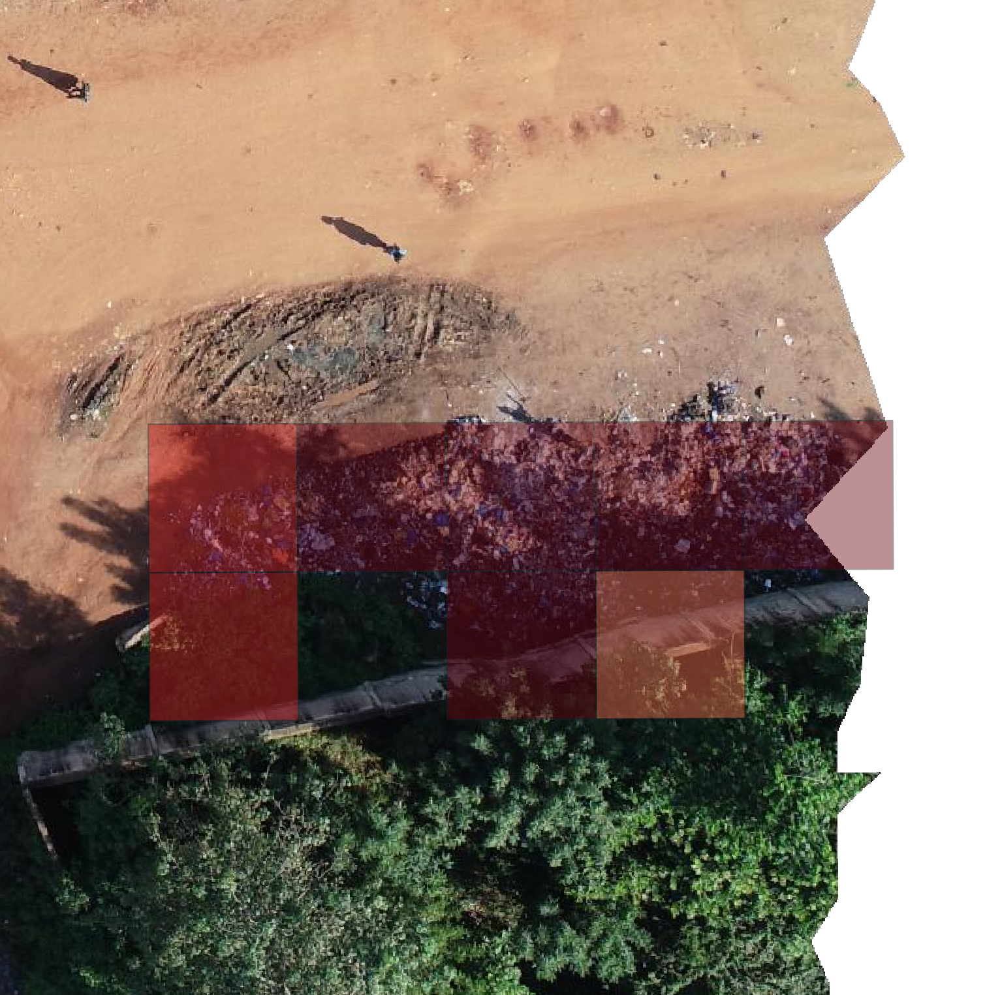

# YOLO Solid Waste Analysis for Spatial Grid (SWAG)


[](https://opensource.org/licenses/MIT)

This repo contains the labels and scripts for the **YOLO Solid Waste Analysis for Spatial Grid (SWAG)** for detecting solid waste piles from UAV imagery.
The model is based on a previous work, that can be found [here](https://doi.org/10.48550/arXiv.2605.02316).

YOLO SWAG (Solid Waste Analysis on spatial Grids) is a pretrained YOLO26x-cls model for 
semantic segmentation of solid waste piles in UAV (drone) imagery. The model classifies 5m x 5m grid cells as either 
"waste" or "background" based on polygon labels, enabling efficient waste detection in OpenAerialMap (OAM) scenes and other aerial datasets.

## How to use the data

The GPKG-files in *./data/labels* are following this naming schema: `{continent}_{country}_{city}_{openaerialmap_id}_tiles.gpkg`.
The original labels from the previous work are included aswell and follow the schema `{openaerialmap_id}_tiles.gpkg`
Download the aerial images from [OpenAerialMap](https://openaerialmap.org/). After that run:

```shell
uv run python scripts/create_labeling_grid.py <path/to/oam_files> <path/to/output/directoy>
```

The content of the output directory can be loaded into QGIS or similar applications for labelling. Tiles containing 
waste piles are labelled with class "1" and background with class "2".

## Examples



